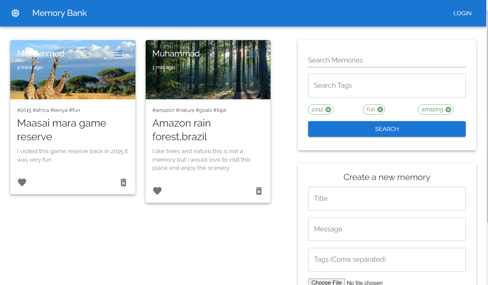
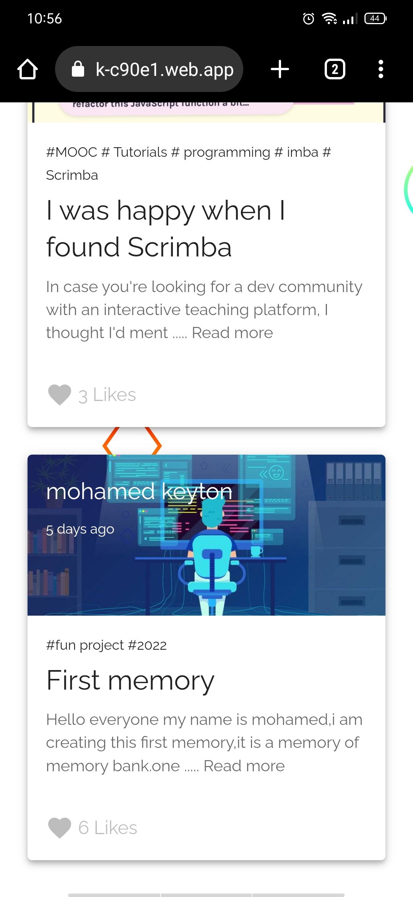
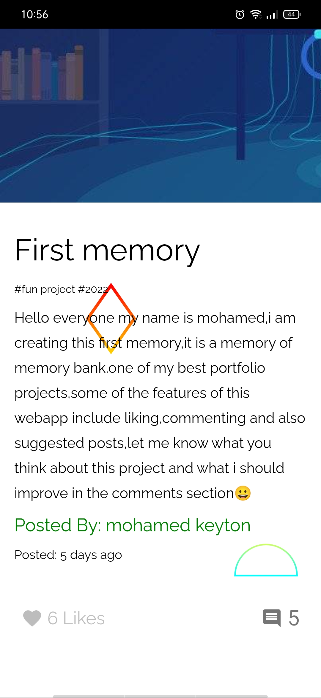
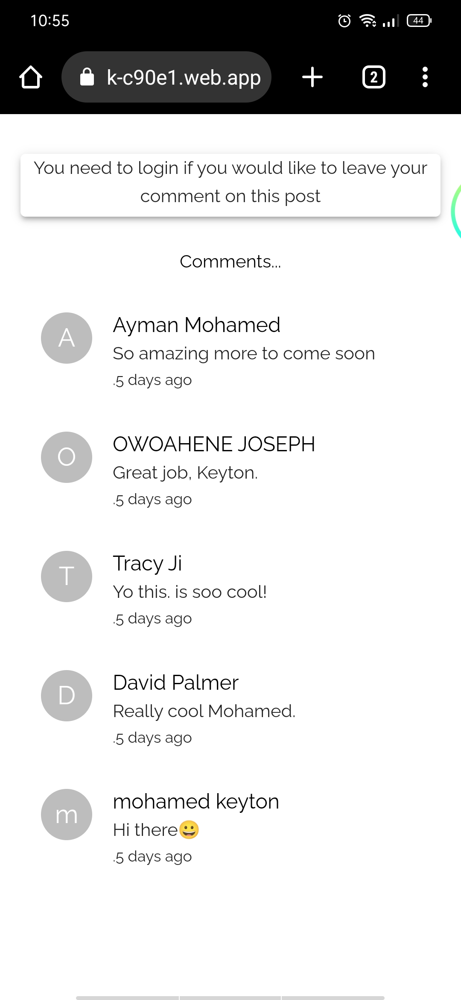

# MemoryBankApp - A fullstack social media webApplication

MemoryBank is a webApplication where users can interact with other users.

## Main Menu

- [Overview](#overview)
  - [LargerScreens Screenshot](#largerScreens-screenshot)
  - [Mobile Screenshot](#mobile-screenshot)
  - [Link](#link)
  - [Built with](#built-with)
  - [Next versions](#next-versions )

## Overview
This version of memory bank has the following features.
 - comments section,
 - post creation and deleting,
 - liking functionality,
 - posts recommendations(if a post you are viewing has the same tags as other posts then you get recommended those other posts)
 - Local authentication and Google Oauth
 - search functionality

### LargerScreens Screenshot

### Mobile Screenshot

### Link
- checkout it out here: [memoryBank](https://memorybank-c90e1.web.app/)

### Built with

- React js
- Material UI
- Express Js
- Redux Toolkit
- Firebase
- MongoDb

### Next versions 
In the coming versions of memoryBank I am working on implementing direct messages functionality,follow functionality and i will also try to push myself alittle further and try to add audio calls and vedio calls.

